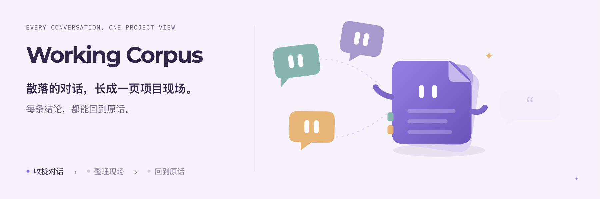

<p align="center">
  <picture>
    <source media="(prefers-color-scheme: dark)" srcset="docs/logo-dark.png">
    
  </picture>
</p>

<h1 align="center">Working Corpus</h1>
<p align="center"><strong>You jump between Claude Code, Codex, VS Code and web AI chats. Working Corpus turns those conversations into one page about your project, and every claim on it links back to the original words.</strong></p>

<p align="center">
  <a href="LICENSE"></a>
  
  
  
</p>

<p align="center">
  <a href="README.md">简体中文</a> ·
  <a href="https://longado.github.io/working-corpus/">Live demo</a> ·
  <a href="https://longado.github.io/working-corpus/media/explainer.mp4">Explainer video (Chinese)</a> ·
  <a href="#quick-start">Quick start</a> ·
  <a href="#build-with-us">Build with us</a>
</p>

<p align="center">
  
</p>
<p align="center"><sub>Concept illustration · <a href="docs/media/working-corpus-poster.png">Still image</a> · <a href="docs/media/working-corpus-motion.mp4">MP4</a></sub></p>

Other memory tools feed memory back to the AI. **Working Corpus hands the state of the project to you, and it only counts evidence.**

**Runs on your machine. Every claim has a quote. "Done" from an AI means "to be verified".**

Come back the next day and, instead of scrolling through long chats, run one command or open one window to see: what you set out to build, what changed since, what's really done and what the AI only says is done, where things are stuck, and what's next. When you switch tools, you take an accurate briefing with you.

It's a **local app**: a `corpus` command in the terminal and a standalone desktop window. Your data stays on your machine.

> **Early alpha.** Everything in requirements v0.2 is built, but it hasn't been used on real projects over time, and there's no real-world data yet on how accurate the summaries are. See [Current status](#current-status).

The explainer video and the product UI are in Chinese. The [live demo](https://longado.github.io/working-corpus/) needs no install: it opens a sample project, a bookkeeping mini-app, built from six conversations across Gemini on the web, Codex and Claude Code. You can see task status, both versions of the plan, superseded decisions and the quote behind every claim, and copy a briefing for the next AI. It's read-only.

<p align="center"></p>

<p align="center"></p>

<sub>Both recordings use the sample project and are generated by script; no real conversations. Full quality: <a href="docs/media/terminal.mp4">terminal MP4</a> · <a href="docs/media/window.mp4">window MP4</a>. How to re-record: <a href="docs/DEMO.md">demo script</a>.</sub>

## What to try

After installing, run `corpus demo` and try these in the sample project:

| Try | What you'll see |
|---|---|
| `corpus show` | Plan version 2; every task says what its status rests on: you confirmed it, the source says so, or the AI claims it |
| In the window, open the evidence on the "monthly export" row | The AI says it's done, and you see the AI's own words, so it stays "to be verified" |
| Click "continue" | A briefing for the next AI: it failed before, confirm the done criteria first, don't build cloud sync |
| `corpus context --task T04` | The same briefing, in the terminal |
| Switch to "to confirm" | A "budget reminder" the AI proposed on its own; it isn't a task until you say yes |

## Quick start

You need Node 22.18 or newer. No build step, no model setup for the demo.

### Option A: let your coding agent set it up

Paste this into Claude Code, Codex or any assistant that can use a terminal:

```text
Help me set up https://github.com/Longado/working-corpus on this machine.
Read README.en.md first. Check that Node is 22.18 or newer, clone the repo,
run npm install and npm link, then run corpus demo to create the sample
project and corpus app to open the window for me.
```

### Option B: do it yourself

```
git clone https://github.com/Longado/working-corpus && cd working-corpus
npm install && npm link          # installs the global corpus command

corpus demo                      # builds the sample project from bundled data
corpus                           # terminal: overview of all projects
corpus show                      # terminal: one project
corpus app                       # desktop window: starts the local service in the background
corpus stop                      # stops the background service
```

On macOS you can build a double-clickable app:

```
npm run mac-app                  # creates dist/Working Corpus.app with a pixel icon
```

## Use it on your own project

```
cp .env.example .env                                   # add DEEPSEEK_API_KEY
corpus project add "name" --dir /path/to/your/code --goal "one-line goal"
corpus app                                             # click "sync" in the window
```

After that, run `corpus show` inside the project directory, or `corpus context --task T03` to print the briefing for one task and paste it into any AI tool.

## The four questions

If you build with AI, you ask these every day:

1. What did I set out to build, and which requirements changed since?
2. What's actually done, and what did the AI only say is done?
3. Where is it stuck, and what's next?
4. How do I start a new session or tool without explaining the whole project again?

The answers are in your chat history, scattered across dozens of conversations in different tools. Working Corpus reads them and puts them on one page.

## What it does

| | |
|---|---|
| Reads conversations | Claude Code, Codex (CLI and VS Code extension) and VS Code's built-in chat, straight from local files, grouped into projects by code directory. Web AI chats can be pasted in or imported from a Google Takeout zip; Gemini also has a browser extension that adds a chat in one click and keeps it updated |
| Project page | Current goal and plan version, where you left off, what needs you, what's next, tasks, recent decisions. A strip at the top shows one block per message, colored by the status of the task it supports |
| Task status | The same work across tools counts as one task. An AI saying "done" only makes it "to be verified"; it's done once you confirm. Rework reopens the original task instead of adding a new one |
| Plans and decisions | The first plan, the current plan and every change are kept. AI proposals you didn't confirm stay out of scope. Decisions overturned later are marked "superseded". If the source gives no reason, it says "not stated" |
| Next steps | At most three, each with done criteria, preconditions and evidence. You can adopt, defer or reject; cancelled items are never suggested again |
| Briefings | Goal, current plan, progress on this task, related decisions, blockers, preconditions, and a "don't do" list of cancelled items. Copy or export |
| Tracing and correcting | Every claim opens to its quote. Merge, split, rename, change status, move to another project, remove a misfiled session, rebuild from scratch. Your edits are never silently overwritten by automatic updates. When two sources disagree and their order can't be told, both are shown for you to decide. Edited and resent messages keep the old version but stop counting it |

## How it's different

- **For people, not for the AI.** claude-mem and ai-memory write memory back to the AI; SpecStory archives conversations. Working Corpus gives you a project page you can take in at a glance.
- **Evidence only.** "Done" or "tests pass" from an AI is "to be verified". Every status says whether it rests on your confirmation, the source text, or the AI's own claim.
- **The model does one thing.** It only tags messages as evidence, and must quote them. Status, counts, plan versions, next steps and preconditions are computed by code from fixed rules, so the same records always give the same result.
- **You have the last word.** Your corrections win; when they conflict with new evidence, the conflict goes to "to confirm" for you to settle.

## Connect it to your AI tools

These are thin connectors and need the local app running.

| Connector | What it does | Notes |
|---|---|---|
| Claude Code plugin | Pulls the project page and briefings into a conversation; syncs in the background when a session ends | `/plugin marketplace add Longado/working-corpus`, see `docs/PLUGIN.md` |
| MCP server | For Codex, Cursor and other MCP clients | See `docs/MCP.md` |
| Gemini browser extension | One click on a Gemini chat adds it to a project and keeps it updated | Load `extension/` in developer mode, see `docs/EXTENSION.md` |

## How it works

<p align="center"></p>

The model does one thing: it reads new messages and marks which message says what happened to which task, quoting the original. Evidence citing text that doesn't exist is dropped. Who said something comes from the source, not from the model. Without your own words, nothing counts as confirmed by you. Task status, plan versions, decisions and next steps are all computed by code, so the same evidence always gives the same result.

Full rules: `docs/contracts.md`.

## Data and privacy

- Only conversations under directories you've linked are read. Nothing else.
- Data lives in `~/.working-corpus/`. The local service listens on 127.0.0.1 only and allows cross-origin requests only from the browser extension; websites are refused.
- Before the first summary, it tells you what will be sent, and only sends conversation text to the remote model after you agree. Anything that looks like a key or token is replaced with a placeholder when it's read.
- You can pause collection (existing data stays) or delete a project (its records go with it).

## Current status

Everything in requirements v0.2 (P0, P1 and the additions) is done. 122 tests. In real-model evaluation on seven sample scenarios, no hard red line has ever failed. Summarizing a real 74-message project with `deepseek-flash` takes about two minutes. The evaluation log is in `docs/EVAL.md`; the samples are few, so it only shows these scenarios work, not how accurate it is on real conversations.

Not yet checked against real data: the Takeout export format for Gemini on the web, the browser extension on real signed-in pages, and the model's long-term accuracy on real projects.

Known limits: instructions an orchestration tool (such as Orca) sends to a worker are counted as your words. Codex tool errors and Claude Code subagent sessions aren't read yet. Message edit history in Codex and VS Code's built-in chat isn't handled yet.

## What's next

Directions, not a schedule.

- Calibrate on real projects: log every manual correction; where corrections pile up is where the rules should change.
- Evidence beyond conversations: treat git commits, test results and CI status as evidence, so "to be verified" can rest on something firmer.
- A badge for every AI: count how often each tool's "done" gets sent back and which tasks each one worked on. This was the project's first name, "Agent badge".
- More sources: extensions for ChatGPT and Claude on the web, importing files right from the page, and an "unsorted" inbox for conversations whose project isn't clear.
- Teams: several people's AI conversations on one project page.
- A standalone installer that bundles Node and is signed, for machines without a dev setup.

## Build with us

The question behind this project: **can conversations scattered across several AI tools add up to one project page you'd actually trust?** You don't need to solve all of it to help.

| You enjoy… | A useful contribution |
|---|---|
| Building real projects with AI | A case where the summary got something wrong: which claim, and what the original said (remove anything sensitive first) |
| Digging into an AI tool | New sources: imports or browser extensions for ChatGPT or Claude on the web |
| Evaluation | New sample scenarios and hard red lines for `corpus eval` |
| Frontend and interaction | The project page in the window, the message strip |
| Writing | English docs, setup notes for other systems |

Open an issue or a pull request.

## Development

```
npm test                     # unit tests, no model calls
npm run typecheck
corpus eval                  # runs samples against the real model; fails if any hard red line fails
```

Docs are in `docs/` (in Chinese): demo script, plan, requirements gap, contracts, evaluation log, product-form notes, the three connectors, and the handoff note. The only prompt is `prompts/evidence.md`, with its version in the header.

## License

MIT
